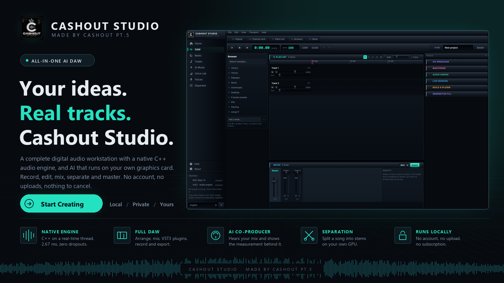

<p align="right"><b>English</b> · <a href="README.ru.md">Русский</a></p>

<p align="center">
  
</p>

<h1 align="center">Cashout Studio</h1>
<p align="center"><i>Made by Cashout PT.5</i></p>

<p align="center">
  A complete, local music production studio: a multitrack DAW with a native
  C++ audio engine, and AI that runs on your own graphics card. No account,
  no uploads, nothing to cancel.
</p>

<p align="center">🚧 Actively in development. Expect breaking changes, bugs and rough edges. Not a stable release yet.</p>

<p align="center">
  
  <a href="LICENSE"></a>
  
  
  
  
  
</p>

<p align="center">
  
</p>

<p align="center"><sub>Not a mockup. That is the application, captured running.</sub></p>

<p align="center">
  <a href="#why-this-exists">Why</a> ·
  <a href="#whats-inside">What's inside</a> ·
  <a href="#ace-step-generation">ACE-Step</a> ·
  <a href="#yue2-and-sheetsage2-generation">YuE2</a> ·
  <a href="#lora-training-ace-step">LoRA</a> ·
  <a href="#voices">Voices</a> ·
  <a href="#separation-lab-uvr-style">Separation</a> ·
  <a href="#built-in-daw">DAW</a> ·
  <a href="#built-with">Built with</a> ·
  <a href="#license--liability-for-generated-content">License</a> ·
  <a href="#-installation">Installation</a>
</p>

---

## Why this exists

ACE-Step and YuE2 are two independent music generation engines, each with its own web UI, its own result-storage format, and its own process that has to be started and stopped by hand. They typically cannot run simultaneously on a single consumer GPU. Cashout Studio solves this with a single layer on top:

- **One UI** instead of two different interfaces with different UX.
- **Mutually-exclusive orchestrator**: pick a model in the header — it starts up, and the other one stops on its own. No need to manually kill processes before starting the other engine.
- **Shared storage**: every track (generated, uploaded, or assembled in the editor) is tracked in a centralized SQLite database and shared folder, available from every module — Demucs, MuScriptor, the mixer and the editor all work off the same library instead of three separate ones.
- **A DAW on top of generation**: a generated track isn't the end point, it's raw material — split it into stems, mix it down, drag it onto a timeline, blend it with other tracks, and export.
- **Built-in LoRA training**: not just generation — fine-tune ACE-Step on your own voice or style right from the browser, no console needed.

---

## What's inside

| Module | What it does |
|---|---|
| **ACE-Step 1.5** | Fast generation from text/style tags, covers, section repainting, extracting/adding parts on top of a reference track. |
| **YuE2-3B** | Full-length track generation with CoT score planning (a symbolic ABC plan before the audio). |
| **SheetSage2** | Extracts melody and harmony from a reference track into ABC notation — used as YuE2's input. |
| **LoRA training** | Dataset → auto-labeling → preprocessing → training → export — the whole ACE-Step fine-tuning pipeline for your own voice/style, in the browser. |
| **Voices** | Import a voice clip, then speak text in it (Chatterbox) or re-sing an existing track in it (Seed-VC). |
| **Separation lab** | UVR-style multi-model separation with spectral ensembles (BS-RoFormer, Mel-Band RoFormer, HTDemucs), on the GPU. |
| **Demucs** | Splits any track into 4 stems: vocals, drums, bass, other. |
| **MuScriptor** | Transcribes audio (the full mix or a single stem) into MIDI notes. |
| **Built-in DAW** | A multitrack timeline editor for assembling tracks/stems into a final mix. |

The interface is fully bilingual (Russian/English, switcher in the header).

---

## ACE-Step: generation


Two input modes: **“Simple”** — a single text description the model uses to infer both style and lyrics on its own; and **“Custom”** — style tags with autocomplete plus lyrics with structure markup (`[Verse]/[Chorus]/[Bridge]`) and performance annotations (`(whisper)`, `(falsetto)`), or an “Instrumental” checkbox.

Attaching a reference track unlocks 5 remix scenarios:
- **Cover** — restyle while keeping the melody (tunable original-preservation strength).
- **Repaint a section** — replace only a chosen part of the track.
- **Extract a part** — pull one instrument/voice out of a finished mix (12 options: vocals, drums, bass, guitar, etc.).
- **Add a part** — compose one missing instrument on top of the mix.
- **Finish the composition** — the same, but for a whole list of parts at once.

Plus: 10–300 s duration, batch of 1/2/4 variants, mp3/wav/flac formats, advanced parameters (BPM, key, time signature, vocal language, inference steps, guidance scale, seed), LoRA adapter support with adjustable strength, local presets, and a "Stop all" button for bulk job cancellation.

## YuE2 and SheetSage2: generation


Three **CoT (Chain-of-Thought)** modes: `off` — straight to audio; `melody` — the arrangement is built around a given melody (ABC); `full` — the model first builds a symbolic plan (melody + chords), then generates the audio.

**SheetSage2** lets you upload a reference track and pull its melody into ABC notation, right in the form, with one click — editable by hand afterwards. Beyond that: `q8_0`/`q4_0` precision, batch of 1–4, a full set of sampling parameters for audio generation and the ABC planner separately, local presets, and viewing/reusing the ABC score of an already-generated track.

## LoRA training (ACE-Step)


The full ACE-Step fine-tuning pipeline on your own dataset, no console required:

1. **Dataset** — upload audio files straight from the browser (drag & drop) or point at an existing server folder, a trigger word, an "all tracks are instrumental" flag.
2. **Automatic labeling** — LLM-generated description, genre, BPM/key, lyrics transcription/reformatting.
3. **Review and edit** — a table of every sample where you can fix the description/genre/tags before training.
4. **Preprocessing** — converts labeled samples into tensors.
5. **Training** — LoRA rank/alpha/dropout, learning rate, epochs, batch size, FP8, gradient checkpointing, live progress with an ETA and a TensorBoard link.
6. **Export and registry** — the finished adapter is immediately added to the LoRA list on the generation form.

## Voices

Import a voice once and use it anywhere — no training run involved. Both
models read your reference clip at generation time, which is what makes this
usable on a card that could never finish a fine-tune.

1. **Import** — drop in a clean 5–20 second clip (one speaker, no music). It's
   stored as the voice library audio.cpp reads directly, so it's immediately
   selectable as a cloning reference.
2. **Speak** — type text, get it spoken in that voice (Chatterbox, 19 languages).
3. **Convert** — re-sing or re-speak existing audio in that voice (Seed-VC,
   with a dedicated singing path). Point it at a saved track — ideally at its
   isolated vocal stem, one click away via Demucs — or at any uploaded file.
   The result lands in your track library like any other track.

Voices live inside YuE2's engine process, so the **Voices** tab appears while
YuE2 is the active model.

## Separation lab (UVR-style)

The same workflow Ultimate Vocal Remover made standard — pick models, ensemble
them, audition the result — running on `audio.cpp`'s native separation models,
so it is GPU work on any vendor rather than a CPU-bound PyTorch stack.

| Model | Stems | Notes |
|---|---|---|
| **BS-RoFormer ep368** | vocals, instrumental | Band-split transformer, the current quality leader for vocal isolation. |
| **Mel-Band RoFormer** | vocals, instrumental | Mel-band sibling; disagrees with BS-RoFormer in useful ways, which is what makes an ensemble worth running. |
| **HTDemucs v4** | vocals, drums, bass, other | The four-way split. |

**Ensemble mode** runs several models over the same track and combines each
stem they share:

- **Max Spec** — per time-frequency bin, keep the loudest model. Fuller; recovers detail a single model missed.
- **Min Spec** — keep the quietest. Cleaner; drops anything the models disagree about, which is usually bleed.
- **Average** — plain waveform mean. Safe, slightly duller transients.

Phase travels with whichever magnitude won each bin, so the combination
doesn't smear. The instrumental is derived from the vocals the ensemble
actually produced, which keeps the two halves summing back to the original
mix — measured residual on a test separation is ~6e-05 RMS, so layering them
in the editor reconstructs the source instead of leaving residue.

Options mirror what you'd expect: GPU toggle, output as WAV/FLAC/MP3, vocals
or instrumental only, and a 30-second **sample mode** for trying settings
without processing a whole song (it deliberately doesn't touch the track's
saved stems). Finished stems attach to the track, so the mixer, MIDI
transcription and the DAW all pick them up.

## Stem separation (Demucs)


One click splits any saved track into 4 isolated stems (Demucs `htdemucs`), with a progress bar, a separate player and download per stem, and the option to redo or delete. Runs alongside the active generation model (without stopping it), sharing a GPU lock.

## MIDI transcription (MuScriptor)


Transcribes the full mix, or any already-separated stem, into MIDI. Technically this isn't a separate process — it's a model loaded into the already-running YuE2 server, so **transcription requires YuE2 to be the active model**. Result: a built-in Web Audio synth player, a mini piano roll, a note count and BPM readout, and `.mid` download.

## Mixer


A fixed 4-channel console (vocals/drums/bass/other + master) for a quick stem mixdown: volume, pan, mute/solo, a 3-band EQ, a compressor, reverb, and VU meters with clipping indication. Settings are saved automatically. The **"Open in editor"** button carries all 4 stems with their current settings into a new full-DAW project — the mixer is meant as a quick preview, the editor as its superset.

## Built-in DAW


Any number of tracks, onto which you can add anything from the shared library (a full mix, a single stem, a file uploaded from disk) — via a picker dialog or by dragging a file straight onto a track.

- Free clip repositioning and edge trimming (non-destructive — the source file is untouched), with magnetic snapping to neighboring clips and to timeline zero.
- **Undo/Redo** (Ctrl+Z / Ctrl+Y) — up to **30 steps** of history.
- Hotkeys: `Space` — play/pause, `Delete` — remove clip, `Ctrl+D` — duplicate, `Ctrl+wheel` — zoom.
- Guards against losing unsaved edits when closing the tab or navigating away.
- **Micro-fades**: automatic 15 ms linear ramps at each clip's edges — remove digital clicks from hard cuts.
- VU meters with clipping on every track and the master bus; the same channel strip (EQ/compressor/reverb) as the mixer.
- Export the mixed-down project as **WAV** or **MP3** — rendered offline (the same processing graph as live playback) and saved back into the shared track library.

---

## Architecture

- **`backend/`** — FastAPI (Python). `app/orchestrator/` manages the models' process lifecycle (start/stop/health-poll) and enforces their mutual exclusion on a single GPU. `app/api/routes_proxy.py` reverse-proxies `/api/ace/*` → ACE-Step's REST API (port 8001) and `/api/yue2/*` → YuE2's native server (`audiocpp_server.exe`, port 8080). `app/db.py` + `routes_tracks.py` are the shared SQLite database and files, organized per model, regardless of how a track was created (generation, upload, or assembled in the editor).
- **`frontend/`** — Vue 3 + TypeScript + Tailwind v4 + Pinia + vue-router + vue-i18n. A fully native implementation (not an iframe) on top of the models' original APIs — `src/audio/` contains its own Web Audio engine (mixer, timeline, effects, a MIDI parser and synth, WAV/MP3 encoders).
- Only the models' own inference process (`acestep-api` and `audiocpp_server.exe`) runs from their original code — everything else (UI, proxying, storage, file upload/transcoding) is written in this repository. YuE2's own web UI (`web-ui/server.py`) is no longer used — the one useful part of it (transcoding non-WAV uploads via ffmpeg) has been ported to `backend/app/api/routes_yue2_upload.py`.

---

## Built with

Cashout Studio is a UI and orchestrator on top of third-party inference engines. Their code isn't vendored into this repository — only small functional patches (`external/patches/`) on top of the originals:

| Project | What's used | License |
|---|---|---|
| [ACE-Step-1.5](https://github.com/ace-step/ACE-Step-1.5) | Text/style-driven music generation engine, LoRA training | MIT |
| [audio.cpp](https://github.com/0xShug0/audio.cpp) (`dev` branch) | YuE2 (generation), SheetSage2 (melody extraction), MuScriptor (MIDI transcription) | Apache-2.0 |
| [Demucs](https://github.com/adefossez/demucs) | Stem separation (`htdemucs`) | MIT |

Patch details and exact base commits are in [`external/patches/README.md`](external/patches/README.md).

---

## License & liability for generated content

Cashout Studio's own code (this repository) is [MIT-licensed](LICENSE). That covers the UI and orchestrator only — it is a separate thing from the license of a *track* you generate with it. Cashout Studio is an orchestrator, not a generator with its own model — all audio is produced by third-party engines (ACE-Step 1.5, YuE2-3B, and the SheetSage2/MuScriptor tools built on top of them). Because of that:

- **The author of Cashout Studio takes no responsibility** for what happens to tracks generated through this app afterward — commercial or otherwise, published or private. Whatever you create, and how you use it next, is entirely your own responsibility.
- **A generated track is covered by the license of whichever model produced it**, not by a license from this repository. The table above lists the *code* license — the *model weights* can be licensed differently:
  - **ACE-Step 1.5** — both the code and the model weights are MIT-licensed, and the model's authors explicitly state the generated music can be used commercially.
  - **YuE2-3B** — the model weights (unlike audio.cpp's own Apache-2.0 *code*) are distributed under **CC BY-NC 4.0**. That means tracks generated through YuE2 **cannot be used commercially** without separate permission from the rights holder, and attribution is required for any use.
- Before publishing, monetizing, or otherwise distributing a generated track, **check the current license terms of that specific model** on its HuggingFace/weights page — those terms belong to the model's own rights holder and can change independently of this repository.
- Cashout Studio is provided "as is", with no warranty of any kind. By using it, you accept that verifying a generated track's compliance with applicable law and with the license of the model that produced it is solely your responsibility.
- **Attribution**: if you fork, copy, or build on Cashout Studio's code, keep the credit — a link back to this repository and to Nikolay Cherkashin ([inikolax](https://github.com/inikolax)) as the original author. The MIT license above already requires keeping the copyright notice in any copy; this is just that requirement spelled out plainly.

---

## 📦 Installation

### Step 0: build tools

```cmd
setup_prereqs.bat
```

Via `winget` (built into Windows 10/11), installs Git, Python, `uv`, Node.js,
CMake, ffmpeg, plus Visual Studio Build Tools (C++ workload) and the Vulkan
SDK — the last two are large, need admin rights, and can take a while.

The Vulkan SDK is what makes the GPU side vendor-neutral: `audio.cpp` is
built against its Vulkan compute backend, which runs on AMD, Intel and
NVIDIA alike and needs no vendor toolkit at runtime — just the
`vulkan-1.dll` loader that ships with any modern GPU driver.

**The GPU driver itself is deliberately left out** — install it by hand from
[AMD](https://www.amd.com/support) or [NVIDIA](https://www.nvidia.com/drivers)
for your card: silently swapping a video driver on someone else's machine is
risky (it can blank the screen and usually needs a reboot on your schedule,
not the script's).

After installing, close the terminal and open a new one so PATH picks up the
freshly installed tools.

### Step 1: generation engines

```cmd
setup_models.bat
```

The script:
1. Clones `ace-step/ACE-Step-1.5` (MIT) and `0xShug0/audio.cpp` (Apache-2.0,
   `dev` branch — YuE2 support is dev-only for now) into `external/`.
2. Applies a small patch to ACE-Step (a task-cancellation API; audio.cpp
   needs no patch, see `external/patches/README.md`) — without the upstream
   custom web-uis, which aren't needed.
3. Installs ACE-Step's dependencies into its own venv and builds
   `audiocpp_server` (Vulkan release, `yue2,sheetsage2,muscriptor` models)
   for audio.cpp.
4. Downloads the YuE2/SheetSage2/MuScriptor GGUF weights (~10 GB) via
   audio.cpp's `tools/model_manager_v2.py`.
5. Sets up a `demucs` venv in `external/Demucs` for stem separation.
6. Creates `backend/.env` with paths to the freshly cloned repositories,
   including `FFMPEG_BIN_DIR` — auto-detected from `ffmpeg`'s winget install
   (`setup_prereqs.bat`), even right after installing it in the same
   terminal, before a new one would pick it up on PATH.

ACE-Step's own weights don't need a separate download — `acestep-api` pulls
them from HuggingFace/ModelScope on first request, the same way its Gradio
UI does.

The script is idempotent — safe to re-run (the `-SkipBuild` / `-SkipWeights`
flags skip the corresponding steps). It expects `git`,
[`uv`](https://docs.astral.sh/uv/getting-started/installation/), Python 3,
CMake, the Vulkan SDK and Visual Studio Build Tools (C++ workload) to
already be installed — if any is missing, that step is simply skipped with a
hint on what to install.

Nothing is left to fill in by hand afterwards: `FFMPEG_BIN_DIR` is
auto-detected, and every other path in `backend/.env` is written from the
folders the script just created.

Hard machine requirements the script can't remove: Windows, a GPU with a
Vulkan-capable driver, and enough VRAM for the engine you run (YuE2-3B at
`q8_0` is ~3.5 GB; the `q4_0` weights are there for smaller cards).

#### GPU acceleration by vendor

|                        | YuE2 / SheetSage2 / MuScriptor | ACE-Step 1.5 · Demucs |
| ---------------------- | ------------------------------ | --------------------- |
| AMD                    | GPU (Vulkan)                   | CPU — see below       |
| NVIDIA                 | GPU (Vulkan, or rebuild with `-Preset windows-cuda-release` for CUDA) | GPU (CUDA) |
| Intel                  | GPU (Vulkan)                   | CPU                   |

ACE-Step and Demucs are PyTorch projects, and PyTorch has no Vulkan path —
on AMD it needs ROCm, whose Windows wheels require Windows 11 (and a
supported card; RDNA1 isn't one anywhere). So **on AMD, ACE-Step generation
runs on the CPU** — slow, but it works. YuE2 is the AMD-friendly engine
here and runs fully on the GPU, as does the separation lab.

`setup_models.ps1` installs CPU torch 2.7.1, the version ACE-Step targets on
Windows. `torch-directml` was tried and dropped: ACE-Step has no DirectML
device-selection path, so it never ran a single operation on the GPU, while
its torch 2.4.1 pin held the stack three minor versions behind ACE-Step's
own (unpinned) `diffusers` — which crashed the VAE import on the first
generation with `Parameter q has unsupported type torch.Tensor`.

### Step 2: build the app

```cmd
python build_dist.py
```

Builds the SPA, freezes the backend with PyInstaller and leaves a
self-contained `Cashout Studio\` folder next to `external\`:

```
Cashout Studio\
    CashoutStudio.exe       the app — backend plus a native window, no console, no browser
    frontend_dist\     the built UI it serves
    .env               copied from backend\.env
```

Double-click `CashoutStudio.exe` (or `Launch_CashoutStudio.bat`) and the studio opens
in its own window. The model engines are still started on demand from
`external\`, so keep that folder alongside — it holds the ~10 GB of weights
the app deliberately doesn't bundle.

### Step 3: build the installer (optional)

```cmd
python build_installer.py
```

Produces `build\installer\CashoutStudio-Setup-0.1.0.exe` — an ordinary Windows
setup wizard (Inno Setup; install it with
`winget install --id JRSoftware.InnoSetup`). It bundles the frozen app, both
`audiocpp` binaries, the engine's `model_specs`, and ffmpeg, so the target
machine needs no git, compiler, Python or uv.

It installs **per-user** into `%LOCALAPPDATA%\Programs\Cashout Studio` rather than
Program Files, deliberately: the app keeps its database, generated audio and
imported voices next to its own executable, which an unelevated process
cannot write inside Program Files. That also means no admin prompt.

The ~13 GB of model weights are **not** bundled — an installer that size is
impractical to build or distribute. The wizard has a page for pointing at an
engine folder you already have (it pre-fills one if it finds
`%USERPROFILE%\remiqora\external\audio.cpp`), and otherwise installs an empty
engine folder to fetch them into later.

Uninstalling removes the program but asks before deleting your library, and
an upgrade never overwrites an `.env` you have edited.

### Running from source instead

```cmd
dev.bat
```
Brings up the backend (port 9000) and the frontend with Hot Module Replacement (Vite, port 5173), creates `backend/.venv` and `frontend/node_modules` on first run, and opens a browser at [http://localhost:5173](http://localhost:5173).

For production mode — build the SPA and serve everything from a single port:
```cmd
prod_run.bat
```
Builds the client via `npm run build` and serves the finished SPA bundle together with the API at [http://127.0.0.1:9000](http://127.0.0.1:9000).

`python backend\run_desktop.py` gives you the same native window as the
packaged build, without freezing it first.

Stem separation's `demucs` uv project is set up by `setup_models.bat` above; the `htdemucs` weights themselves download automatically on first use.

---

## ⚙ Configuration (.env)

Settings live in `backend/.env` (template: `backend/.env.example`;
`setup_models.bat` creates it automatically with paths to the cloned repositories):
```ini
ACE_STEP_DIR=C:\Users\you\remiqora\external\ACE-Step-1.5
YUE2_DIR=C:\Users\you\remiqora\external\audio.cpp
DEMUCS_DIR=C:\Users\you\remiqora\external\Demucs
YUE2_BUILD_DIR=windows-vulkan-release
FFMPEG_BIN_DIR=C:\Users\you\AppData\Local\Microsoft\WinGet\Packages\...\bin
```

- `ACE_STEP_DIR` — root of the cloned and patched ACE-Step-1.5.
- `YUE2_DIR` — root of the cloned audio.cpp (where `audiocpp_server.exe` is built and the YuE2/SheetSage2/MuScriptor GGUF weights live).
- `DEMUCS_DIR` — root of the `demucs` venv used for stem separation.
- `YUE2_BUILD_DIR` — which `build\<preset>` folder to launch `audiocpp_server.exe` from.
- `FFMPEG_BIN_DIR` — folder containing `ffmpeg.exe`/`ffprobe.exe`.

Every path is optional: unset, each one defaults to `external\<repo>` next
to the app. The tuning knobs below are optional too — the defaults suit a
6–8 GB card:

- `YUE2_BACKEND` / `YUE2_DEVICE` — compute backend (`vulkan`, `cuda`, `cpu`, …) and device index for `audiocpp_server` (see `audiocpp_server.exe --list-devices`).
- `YUE2_MAX_LOADED_MODELS` — how many of YuE2/SheetSage2/MuScriptor may stay resident at once. Defaults to `1`, so an audio→MIDI conversion evicts the generation model instead of trying to hold both.
- `YUE2_IDLE_UNLOAD_MS` — release VRAM after this long with no inference (default 5 min; `0` disables).
- `VOICES_DIR` / `VOICE_BACKEND` — where imported reference voices live (default `data/voices` next to the app) and which compute backend voice-conversion jobs use (default: the same as `YUE2_BACKEND`).
- `DEMUCS_THREADS` / `DEMUCS_DEVICE` — threads a stem separation may use (default: a quarter of the logical CPUs) and which torch device it runs on (default: `cpu`, so stems never take VRAM from an active model).

---

## Known limitations

- ACE-Step and YuE2 can now run at the same time, because they no longer compete: YuE2 is on the GPU (Vulkan) and ACE-Step is on the CPU. Set `CONCURRENT_ENGINES=0` to restore the old take-turns behaviour, which is what you want when both target the same GPU. Inside YuE2's own server one model stays resident regardless (`YUE2_MAX_LOADED_MODELS`), so generation and MIDI transcription still take turns rather than competing for VRAM.
- Stem separation runs on the CPU with a thread cap, so it can proceed alongside an active engine without starving it.
- On AMD, ACE-Step generation runs on the CPU (see [GPU acceleration by vendor](#gpu-acceleration-by-vendor)).
- MIDI transcription requires YuE2 specifically to be active (the MuScriptor model loads into its process).
- Windows only — the install/run scripts are written as `.bat`/`.ps1`.
