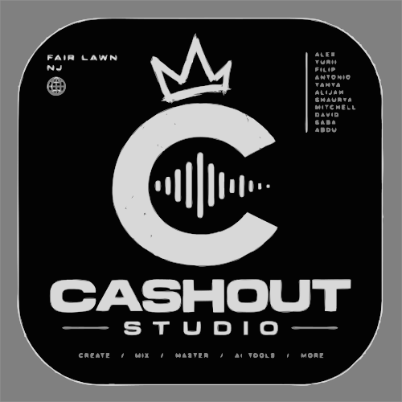
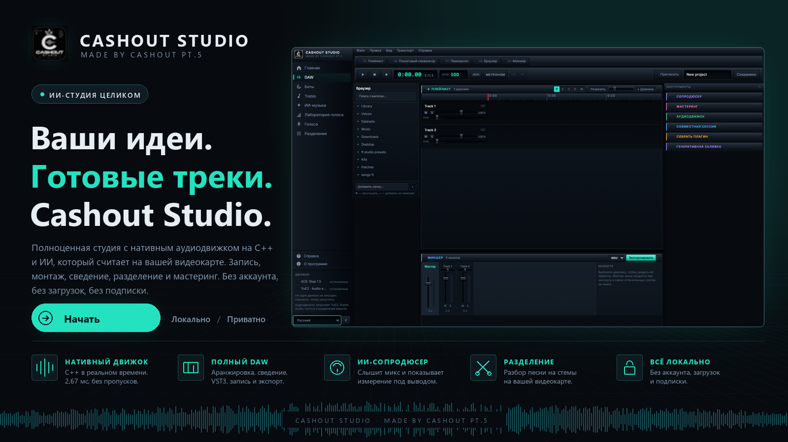
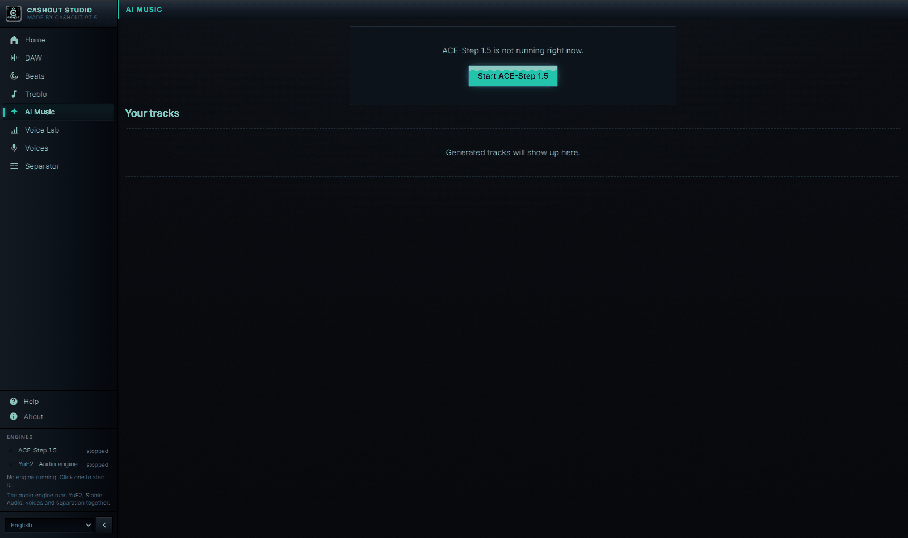
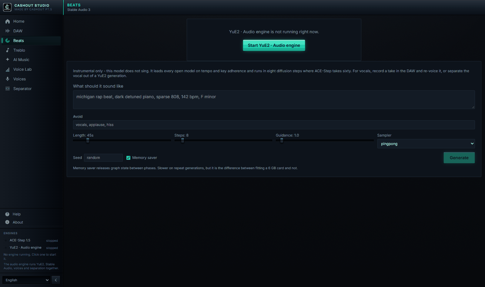
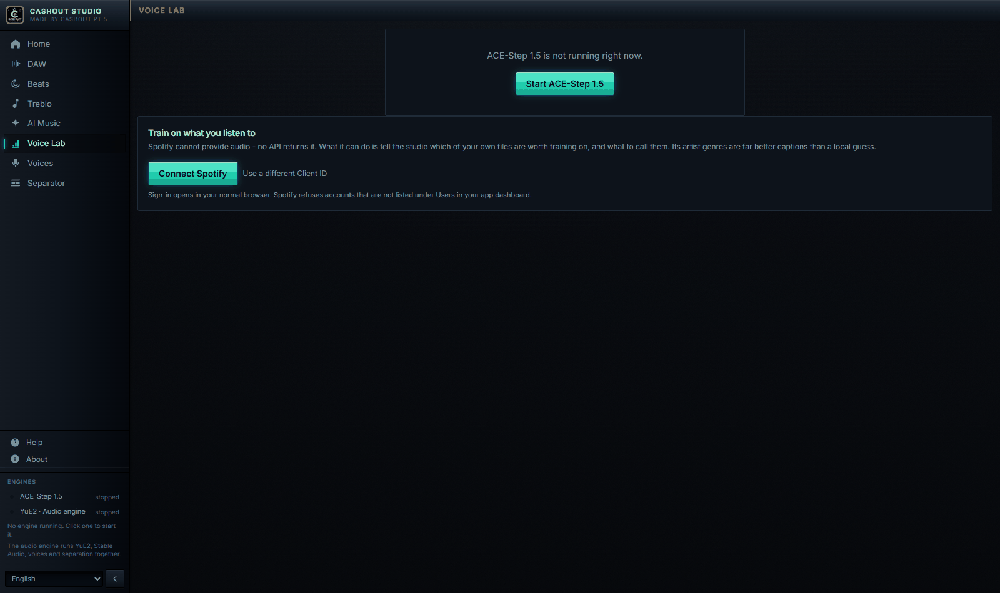
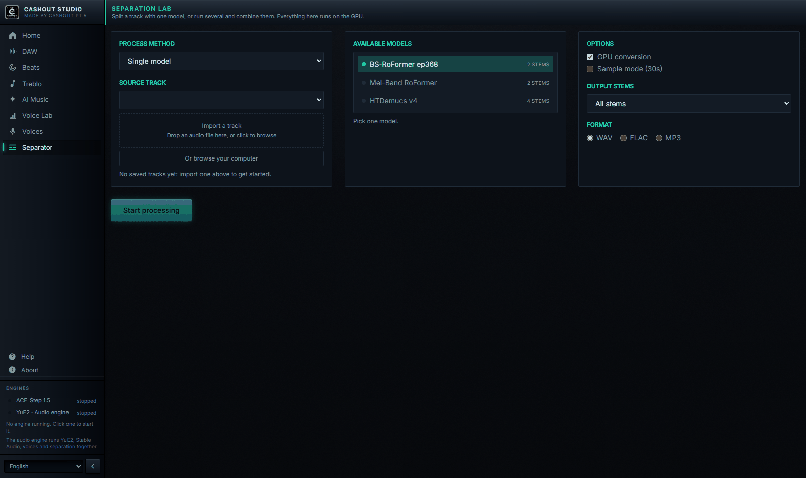
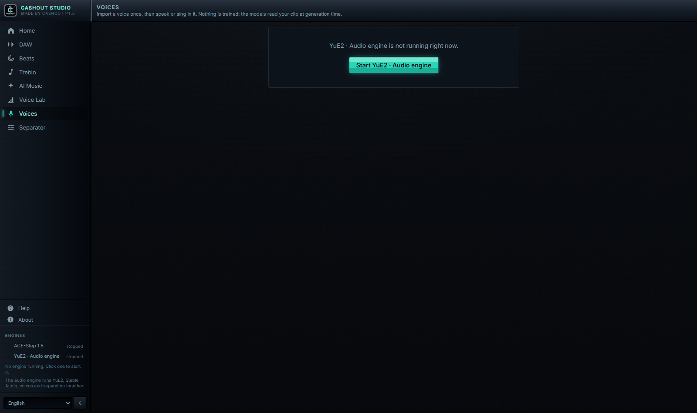
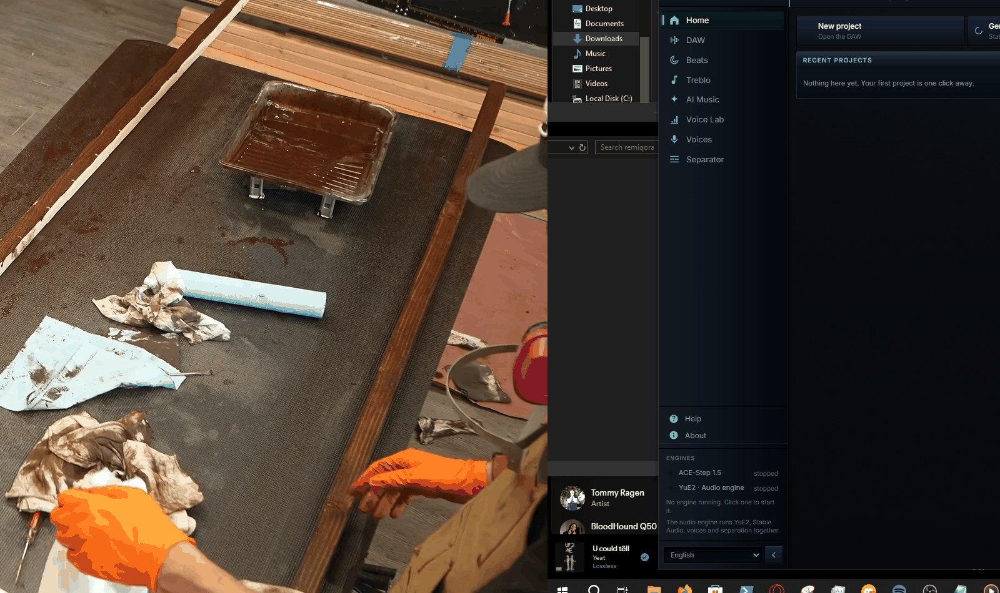

<p align="right"><a href="README.md">English</a> · <b>Русский</b></p>

<p align="center">
  
</p>

<h1 align="center">Cashout Studio</h1>
<p align="center"><i>Made by Cashout PT.5</i></p>

<p align="center">
  Полноценная локальная студия: многодорожечный DAW с нативным аудиодвижком
  на C++ и ИИ, который считает на вашей видеокарте. Без аккаунта, без
  загрузок, без подписки.
</p>

<p align="center">🚧 Активно в разработке. Ожидайте ломающих изменений, багов и шероховатостей. Это ещё не стабильный релиз.</p>

<p align="center">
  
  <a href="LICENSE"></a>
  
  
  
  
  
</p>

<p align="center">
  
</p>

<p align="center"><sub>Это не макет. Это снятое приложение.</sub></p>

<p align="center">
  <a href="#зачем-это-нужно">Зачем</a> ·
  <a href="#что-внутри">Что внутри</a> ·
  <a href="#ace-step-генерация">ACE-Step</a> ·
  <a href="#yue2-и-sheetsage2-генерация">YuE2</a> ·
  <a href="#тренировка-lora-ace-step">LoRA</a> ·
  <a href="#голоса">Голоса</a> ·
  <a href="#лаборатория-разделения-в-стиле-uvr">Разделение</a> ·
  <a href="#встроенный-daw">DAW</a> ·
  <a href="#основано-на">Основано на</a> ·
  <a href="#лицензия-и-ответственность-за-сгенерированный-контент">Лицензия</a> ·
  <a href="#-установка">Установка</a>
</p>

---

## Зачем это нужно

ACE-Step и YuE2 — два независимых движка генерации музыки, у каждого своя веб-морда, свой формат хранения результатов и свой процесс, который надо руками поднимать и гасить. На одной GPU одновременно они не помещаются. Cashout Studio решает это одним слоем:

- **Один UI** вместо двух разных интерфейсов с разным UX.
- **Взаимоисключающий оркестратор**: выбрали модель в шапке — она поднимается, а другая гасится сама. Не нужно руками стопать процессы перед стартом другого движка.
- **Общее хранилище**: все треки (сгенерированные, загруженные, собранные в редакторе) сохраняются в единой библиотеке (SQLite + файлы) и доступны из любого модуля — Demucs, MuScriptor, микшер и редактор работают с одной и той же библиотекой, а не тремя разными.
- **DAW поверх генерации**: результат генерации — это не конечная точка, а сырьё для дальнейшей сборки: разделить на стемы, свести в микшере, перетащить на таймлайн, свести с другими треками и экспортировать.
- **Своя LoRA-тренировка**: не только генерация — можно дообучить ACE-Step на собственном голосе/стиле прямо из браузера, без консоли.

---

## Что внутри

| Модуль | Что делает |
|---|---|
| **ACE-Step 1.5** | Быстрая генерация музыки по тексту/тегам стиля, каверы, перерисовка фрагментов, извлечение/добавление партий поверх референсного трека. |
| **YuE2-3B** | Генерация полноформатных треков с CoT-планированием партитуры (символьный ABC-план перед аудио). |
| **SheetSage2** | Извлечение мелодии и гармонии из референсного аудио в ABC-нотацию — как основа для YuE2. |
| **Тренировка LoRA** | Датасет → авто-разметка → препроцессинг → тренировка → экспорт — весь пайплайн дообучения ACE-Step на своём голосе/стиле в браузере. |
| **Голоса** | Импортируйте фрагмент голоса — и озвучивайте им текст (Chatterbox) или перепевайте им готовый трек (Seed-VC). |
| **Лаборатория разделения** | Разделение несколькими моделями со спектральными ансамблями (BS-RoFormer, Mel-Band RoFormer, HTDemucs), на GPU. |
| **Demucs** | Разделение любого трека на 4 стема: вокал, барабаны, бас, остальное. |
| **MuScriptor** | Транскрипция аудио (полного микса или отдельного стема) в MIDI-ноты. |
| **Встроенный DAW** | Многодорожечный таймлайн-редактор для сборки треков/стемов в финальный микс. |

Интерфейс полностью двуязычный (русский/английский, переключатель в шапке).

---

## ACE-Step: генерация



Два режима ввода: **«Просто»** — одно текстовое описание, из которого модель сама выводит стиль и текст песни; и **«Кастомный»** — отдельно теги стиля (с автодополнением) и текст с разметкой структуры (`[Verse]/[Chorus]/[Bridge]`) и исполнительскими аннотациями (`(whisper)`, `(falsetto)`), либо чекбокс «Инструментал».

Если приложить референсный трек, открываются 5 сценариев ремикса:
- **Кавер** — рестайлинг с сохранением мелодии (регулируется силой сохранения оригинала).
- **Перерисовать участок** — заменить только выбранный отрезок трека.
- **Извлечь партию** — вытащить один инструмент/голос из готового микса (12 вариантов: вокал, барабаны, бас, гитара и т.д.).
- **Добавить партию** — досочинить один недостающий инструмент поверх микса.
- **Дописать композицию** — то же самое, но сразу для списка партий.

Плюс: длительность 10–300 сек, батч 1/2/4 варианта, форматы mp3/wav/flac, расширенные параметры (BPM, тональность, размер такта, язык вокала, шаги инференса, guidance scale, seed), поддержка LoRA-адаптеров с регулировкой силы, локальные пресеты параметров и кнопка «Остановить всё» для массовой отмены задач.

## YuE2 и SheetSage2: генерация



Три режима **CoT (Chain-of-Thought)**: `off` — сразу в аудио; `melody` — аранжировка строится вокруг заданной мелодии (ABC); `full` — модель сначала строит символьный план (мелодия+аккорды), потом генерирует аудио.

**SheetSage2** позволяет загрузить референсный трек и одной кнопкой получить его мелодию в ABC-нотации прямо в форме — можно редактировать вручную. Дальше: точность `q8_0`/`q4_0`, батч 1–4, полный набор sampling-параметров отдельно для аудио-генерации и для ABC-планировщика, локальные пресеты, и просмотр/повторное использование ABC-партитуры уже сгенерированного трека.

## Тренировка LoRA (ACE-Step)



Полный пайплайн дообучения ACE-Step на своём датасете, без консоли:

1. **Датасет** — загрузка аудиофайлов прямо через браузер (drag & drop) или указание готовой папки на сервере, триггер-слово, пометка «все треки инструментальные».
2. **Автоматическая разметка** — LLM-описание, жанр, BPM/тональность, распознавание/переформатирование текста песни.
3. **Проверка и правка** — таблица всех сэмплов с возможностью поправить описание/жанр/теги перед тренировкой.
4. **Препроцессинг** — конвертация размеченных сэмплов в тензоры.
5. **Тренировка** — LoRA rank/alpha/dropout, learning rate, эпохи, batch size, FP8, gradient checkpointing, живой прогресс с ETA и ссылкой на TensorBoard.
6. **Экспорт и реестр** — готовый адаптер сразу попадает в список LoRA на форме генерации.

## Голоса

Импортируйте голос один раз и используйте его где угодно — никакого обучения
при этом не происходит. Обе модели читают ваш референсный фрагмент прямо во
время генерации, и именно поэтому всё это работает на карте, которая никогда
не дотянула бы до полноценного дообучения.

1. **Импорт** — загрузите чистый фрагмент на 5–20 секунд (один голос, без
   музыки). Он сохраняется в ту самую библиотеку голосов, которую audio.cpp
   читает напрямую, так что сразу становится доступен как референс.
2. **Озвучка** — введите текст и получите его этим голосом (Chatterbox,
   19 языков).
3. **Перевод в голос** — перепойте или переозвучьте готовое аудио этим голосом
   (Seed-VC, с отдельным режимом для вокала). Источником может быть
   сохранённый трек — лучше всего его выделенный вокальный стем, до которого
   один клик через Demucs — или любой загруженный файл. Результат попадает в
   общую библиотеку треков.

Голоса живут внутри процесса движка YuE2, поэтому вкладка **Голоса**
появляется, когда активная модель — YuE2.

## Лаборатория разделения (в стиле UVR)

Тот самый рабочий процесс, который сделал привычным Ultimate Vocal Remover —
выбрать модели, объединить их в ансамбль, послушать результат — но на
нативных моделях разделения из `audio.cpp`, то есть на GPU и на любом
вендоре, а не на CPU-зависимом стеке PyTorch.

| Модель | Стемы | Примечания |
|---|---|---|
| **BS-RoFormer ep368** | вокал, инструментал | Band-split трансформер, сейчас лучший по качеству выделения вокала. |
| **Mel-Band RoFormer** | вокал, инструментал | Mel-band «родственник»; расходится с BS-RoFormer ровно так, что ансамбль из них имеет смысл. |
| **HTDemucs v4** | вокал, барабаны, бас, остальное | Классическое разделение на четыре части. |

**Режим ансамбля** прогоняет трек через несколько моделей и объединяет общие
стемы:

- **Max Spec** — в каждом бине время-частота берётся самая громкая модель. Плотнее, возвращает детали, потерянные одной моделью.
- **Min Spec** — берётся самая тихая. Чище, убирает всё, в чём модели расходятся, — обычно это просачивание.
- **Среднее** — обычное среднее по волне. Безопасно, атаки чуть глуше.

Фаза следует за той амплитудой, которая выиграла бин, так что объединение не
«мылит» результат. Инструментал выводится из того вокала, который реально
получился у ансамбля, — поэтому две половины по-прежнему складываются в
исходный микс: на тестовом разделении остаток составил ~6e-05 RMS, то есть
наложение стемов в редакторе восстанавливает оригинал, не оставляя хвостов.

Опции ожидаемые: переключатель GPU, вывод в WAV/FLAC/MP3, только вокал или
только инструментал и 30-секундный **пробный режим**, чтобы подобрать
настройки, не обрабатывая песню целиком (он намеренно не трогает сохранённые
стемы трека). Готовые стемы прикрепляются к треку, так что их сразу видят
микшер, транскрипция в MIDI и DAW.

## Разделение на стемы (Demucs)



Одной кнопкой любой сохранённый трек режется на 4 изолированных стема (Demucs `htdemucs`), с прогресс-баром, отдельным плеером и скачиванием на каждый стем, возможностью пересоздать или удалить. Работает параллельно с активной моделью генерации (не останавливая её) на общем GPU-локе.

## Транскрипция в MIDI (MuScriptor)



Транскрибирует в MIDI полный микс или любой уже отделённый стем по отдельности. Технически это не отдельный процесс, а модель, подгружаемая в уже запущенный сервер YuE2 — поэтому **транскрипция требует, чтобы активной моделью была именно YuE2**. Результат: встроенный плеер на Web Audio синтезаторе, мини Piano Roll, счётчик нот и BPM, скачивание `.mid`.

## Микшер



Фиксированная 4-канальная консоль (вокал/барабаны/бас/остальное + мастер) для быстрого сведения стемов: громкость, панорама, mute/solo, 3-полосный EQ, компрессор, реверб, VU-метры с индикацией клиппинга. Настройки сохраняются автоматически. Кнопка **«Открыть в редакторе»** переносит все 4 стема с текущими настройками в новый проект полноценного DAW — микшер задуман как быстрый предпросмотр, редактор — как его надмножество.

## Встроенный DAW


Произвольное число дорожек, на которые можно добавлять что угодно из общей библиотеки (полный микс, отдельный стем, загруженный с диска файл) — через диалог выбора или прямым перетаскиванием файла на дорожку.

- Свободное перемещение и обрезка краёв клипов (не разрушающая — исходный файл не трогается), магнитное прилипание к соседним клипам и к нулю таймлайна.
- **Undo/Redo** (Ctrl+Z / Ctrl+Y) — история до **30 шагов**.
- Горячие клавиши: `Space` — плей/пауза, `Delete` — удалить клип, `Ctrl+D` — дублировать, `Ctrl+колесо` — зум.
- Защита от потери несохранённых правок при закрытии вкладки или переходе на другую страницу.
- **Микрофейды**: автоматические линейные рампы 15 мс на краях каждого клипа — убирают цифровые щелчки на резких обрезках.
- VU-метры с клиппингом на каждой дорожке и мастер-шине; тот же канал-стрип (EQ/компрессор/реверб), что и в микшере.
- Экспорт сведённого проекта в **WAV** или **MP3** — рендерится оффлайн (тот же граф обработки, что и при живом воспроизведении) и сохраняется обратно в общую библиотеку треков.

---

## Архитектура

- **`backend/`** — FastAPI (Python). `app/orchestrator/` управляет жизненным циклом процессов моделей (старт/стоп/health-poll) и обеспечивает их взаимное исключение на одной GPU. `app/api/routes_proxy.py` реверс-проксирует `/api/ace/*` → REST API ACE-Step (порт 8001) и `/api/yue2/*` → нативный сервер YuE2 (`audiocpp_server.exe`, порт 8080). `app/db.py` + `routes_tracks.py` — общая SQLite-база и файлы, разложенные по модели, независимо от того, как трек был создан (генерация, загрузка, сборка в редакторе).
- **`frontend/`** — Vue 3 + TypeScript + Tailwind v4 + Pinia + vue-router + vue-i18n. Полностью нативная реализация (не iframe) поверх оригинальных API моделей — `src/audio/` содержит собственный движок Web Audio (микшер, таймлайн, эффекты, MIDI-парсер и синтезатор, кодировщики WAV/MP3).
- Из кода самих моделей запускается только их процесс инференса (`acestep-api` и `audiocpp_server.exe`) — все остальное (UI, прокси, хранилище, загрузка/транскодирование файлов) написано в этом репозитории. Собственный веб-UI YuE2 (`web-ui/server.py`) больше не используется — единственная полезная часть (транскодирование не-WAV загрузок через ffmpeg) перенесена в `backend/app/api/routes_yue2_upload.py`.

---

## Основано на

Cashout Studio — это UI и оркестратор поверх сторонних движков инференса. Их код в этот репозиторий не вкладывается, только небольшие функциональные патчи (`external/patches/`) поверх оригиналов:

| Проект | Что используется | Лицензия |
|---|---|---|
| [ACE-Step-1.5](https://github.com/ace-step/ACE-Step-1.5) | Движок генерации музыки по тексту/стилю, LoRA-тренировка | MIT |
| [audio.cpp](https://github.com/0xShug0/audio.cpp) (ветка `dev`) | YuE2 (генерация), SheetSage2 (извлечение мелодии), MuScriptor (транскрипция в MIDI) | Apache-2.0 |
| [Demucs](https://github.com/adefossez/demucs) | Разделение треков на стемы (`htdemucs`) | MIT |

Подробности патчей и точные базовые коммиты — в [`external/patches/README.md`](external/patches/README.md).

---

## Лицензия и ответственность за сгенерированный контент

Собственный код Cashout Studio (этот репозиторий) распространяется по [лицензии MIT](LICENSE.ru.md) ([английский оригинал](LICENSE) — юридически обязательная версия). Это касается только UI и оркестратора — лицензия самого *трека*, который вы сгенерировали, отдельный вопрос. Cashout Studio — это оркестратор, а не генератор со своей моделью: всё аудио создают сторонние движки (ACE-Step 1.5, YuE2-3B и построенные поверх них SheetSage2/MuScriptor). Из этого следует:

- **Автор Cashout Studio не несёт ответственности** за дальнейшую судьбу, использование или распространение треков, сгенерированных через это приложение — ни коммерческую, ни любую другую, опубликованных или приватных. Всё, что вы создаёте, и то, как вы это используете дальше, — полностью на вашей ответственности.
- **На сгенерированный трек действует лицензия той модели, которая его создала**, а не лицензия этого репозитория. Таблица выше — это лицензия *кода*, а лицензия *весов модели* может от неё отличаться:
  - **ACE-Step 1.5** — и код, и веса модели распространяются по лицензии MIT, и авторы модели прямо заявляют, что сгенерированную музыку можно использовать коммерчески.
  - **YuE2-3B** — веса модели (в отличие от *кода* audio.cpp, который под Apache-2.0) распространяются по лицензии **CC BY-NC 4.0**. Это значит, что треки, сгенерированные через YuE2, **нельзя использовать в коммерческих целях** без отдельного разрешения правообладателя, а при любом использовании требуется указание авторства.
- Перед публикацией, монетизацией или иным распространением сгенерированного трека **проверьте актуальные условия лицензии конкретной модели** на её странице/странице весов на HuggingFace — эти условия принадлежат правообладателю модели и могут меняться независимо от этого репозитория.
- Cashout Studio предоставляется «как есть», без каких-либо гарантий. Используя приложение, вы соглашаетесь, что проверка соответствия сгенерированного трека законодательству и лицензии породившей его модели — исключительно ваша ответственность.
- **Указание авторства**: если вы форкаете, копируете или используете код Cashout Studio в своих проектах — сохраняйте ссылку на этот репозиторий и на Николая Черкашина ([inikolax](https://github.com/inikolax)) как автора. Лицензия MIT выше уже требует сохранять копирайт-нотис в любой копии — это просто явное напоминание об этом требовании.

---

## 📦 Установка

### Шаг 0: инструменты сборки

```cmd
setup_prereqs.bat
```

Через `winget` (встроен в Windows 10/11) ставит Git, Python, `uv`, Node.js,
CMake, ffmpeg, а также Visual Studio Build Tools (C++ workload) и Vulkan
SDK — последние два уже большие, требуют прав администратора и могут занять
время.

Именно Vulkan SDK делает GPU-часть независимой от вендора: `audio.cpp`
собирается с его Vulkan-бэкендом, который одинаково работает на AMD, Intel и
NVIDIA и не требует вендорского тулкита в рантайме — достаточно загрузчика
`vulkan-1.dll`, который идёт с любым современным видеодрайвером.

**Сам видеодрайвер намеренно исключён из автоматической установки** —
поставьте вручную с [AMD](https://www.amd.com/support) или
[NVIDIA](https://www.nvidia.com/drivers) под свою карту: молча
подменять видеодрайвер на чужой машине рискованно (может уронить экран,
часто требует перезагрузки в удобный вам момент, а не скрипту).

После установки закройте терминал и откройте новый, чтобы PATH подхватил
свежепоставленные инструменты.

### Шаг 1: движки генерации

```cmd
setup_models.bat
```

Скрипт:
1. Клонирует `ace-step/ACE-Step-1.5` (MIT) и `0xShug0/audio.cpp` (Apache-2.0,
   ветка `dev` — поддержка YuE2 пока только там) в `external/`.
2. Накатывает небольшой патч на ACE-Step (API отмены задач; audio.cpp патч
   не требуется, см. `external/patches/README.md`) — без кастомных web-ui из
   апстримов, они не нужны.
3. Ставит зависимости ACE-Step в его собственный venv и собирает
   `audiocpp_server` (Vulkan-релиз, модели `yue2,sheetsage2,muscriptor`)
   для audio.cpp.
4. Скачивает GGUF-веса YuE2/SheetSage2/MuScriptor (~10 ГБ) через
   `tools/model_manager_v2.py` из audio.cpp.
5. Поднимает venv с `demucs` в `external/Demucs` для разделения на стемы.
6. Создаёт `backend/.env` с путями на только что склонированные репозитории,
   включая `FFMPEG_BIN_DIR` — путь определяется автоматически из
   winget-установки ffmpeg (`setup_prereqs.bat`), даже если она была
   поставлена в этом же терминале, до того как новый терминал подхватил бы
   её в PATH.

Веса самого ACE-Step отдельно скачивать не нужно — `acestep-api` тянет их
сам с HuggingFace/ModelScope при первом запросе, так же как это делает его
Gradio UI.

Скрипт идемпотентен — его можно перезапускать (флаги `-SkipBuild` /
`-SkipWeights` пропускают соответствующие шаги). Для работы скрипта должны быть предварительно установлены:
`git`, [`uv`](https://docs.astral.sh/uv/getting-started/installation/), Python 3,
CMake, Vulkan SDK и Visual Studio Build Tools (C++ workload) — при
отсутствии какого-то из них шаг просто пропускается с подсказкой, что
поставить.

Руками после этого ничего дописывать не нужно: `FFMPEG_BIN_DIR`
определяется автоматически, остальные пути в `backend/.env` пишутся по
папкам, которые скрипт только что создал.

Жёсткие требования к машине, которые скрипт снять не может: Windows,
видеокарта с драйвером, поддерживающим Vulkan, и достаточный объём VRAM под
выбранный движок (YuE2-3B в `q8_0` — это ~3,5 ГБ; для карт поменьше есть
веса `q4_0`).

#### Ускорение на GPU по вендорам

|            | YuE2 / SheetSage2 / MuScriptor | ACE-Step 1.5 · Demucs |
| ---------- | ------------------------------ | --------------------- |
| AMD        | GPU (Vulkan)                   | CPU — см. ниже        |
| NVIDIA     | GPU (Vulkan, либо пересборка с `-Preset windows-cuda-release` под CUDA) | GPU (CUDA) |
| Intel      | GPU (Vulkan)                   | CPU                   |

ACE-Step и Demucs построены на PyTorch, а у PyTorch нет Vulkan-пути: на AMD
ему нужен ROCm, чьи Windows-колёса требуют Windows 11 (и поддерживаемой
карты — RDNA1 не поддерживается нигде). Поэтому **на AMD генерация ACE-Step
идёт на CPU** — медленно, но работает. Дружелюбные к AMD части — YuE2 и
лаборатория разделения: они целиком считаются на GPU.

`setup_models.ps1` ставит CPU-сборку torch 2.7.1 — ту версию, на которую
ACE-Step рассчитан под Windows. От `torch-directml` пришлось отказаться: в
коде ACE-Step нет выбора DirectML-устройства, так что на GPU он не выполнял
ни одной операции, а его жёсткая привязка к torch 2.4.1 держала весь стек на
три минорных версии позади незакреплённого `diffusers` из зависимостей
ACE-Step — из-за чего при первой генерации падал импорт VAE с ошибкой
`Parameter q has unsupported type torch.Tensor`.

### Шаг 2: сборка приложения

```cmd
python build_dist.py
```

Собирает SPA, замораживает бэкенд через PyInstaller и кладёт рядом с
`external\` самодостаточную папку `Cashout Studio\`:

```
Cashout Studio\
    CashoutStudio.exe       приложение — бэкенд плюс нативное окно, без консоли и без браузера
    frontend_dist\     собранный интерфейс, который оно раздаёт
    .env               копия backend\.env
```

Двойной клик по `CashoutStudio.exe` (или по `Launch_CashoutStudio.bat`) — и студия
открывается в собственном окне. Движки по-прежнему запускаются по
требованию из `external\`, так что эту папку нужно держать рядом: в ней те
самые ~10 ГБ весов, которые приложение намеренно не упаковывает в себя.

### Шаг 3: сборка инсталлятора (необязательно)

```cmd
python build_installer.py
```

Собирает `build\installer\CashoutStudio-Setup-0.1.0.exe` — обычный мастер
установки для Windows (Inno Setup, ставится через
`winget install --id JRSoftware.InnoSetup`). В него упакованы замороженное
приложение, оба бинарника `audiocpp`, `model_specs` движка и ffmpeg — так
что целевой машине не нужны ни git, ни компилятор, ни Python, ни uv.

Установка идёт **для пользователя**, в `%LOCALAPPDATA%\Programs\Cashout Studio`, а
не в Program Files, и это осознанно: приложение хранит базу, сгенерированное
аудио и импортированные голоса рядом со своим exe, а туда процесс без прав
администратора писать не может. Заодно и запроса UAC не возникает.

~13 ГБ весов моделей в инсталлятор **не** входят — дистрибутив такого размера
невозможно ни собрать, ни раздавать. В мастере есть отдельный шаг: указать
уже имеющуюся папку движка (если найдётся
`%USERPROFILE%\remiqora\external\audio.cpp`, путь подставится сам), иначе
ставится пустая папка движка, куда веса можно скачать позже.

Удаление убирает программу, но спрашивает перед удалением вашей библиотеки, а
обновление никогда не перезаписывает отредактированный вами `.env`.

### Запуск из исходников

```cmd
dev.bat
```
Поднимает бэкенд (порт 9000) и фронтенд с Hot Module Replacement (Vite, порт 5173), сам создаёт `backend/.venv` и `frontend/node_modules` при первом запуске, открывает браузер на [http://localhost:5173](http://localhost:5173).

Для боевого режима — сборка SPA и раздача с одного порта:
```cmd
prod_run.bat
```
Собирает клиент через `npm run build` и раздаёт готовый SPA-дистрибутив вместе с API на [http://127.0.0.1:9000](http://127.0.0.1:9000).

`python backend\run_desktop.py` открывает то же нативное окно, что и
собранное приложение, но без предварительной заморозки.

Venv с `demucs` для разделения на стемы поднимает сам `setup_models.bat` (см. выше); веса `htdemucs` скачиваются отдельно и сами при первом использовании.

---

## ⚙ Конфигурация (.env)

Настройки хранятся в файле `backend/.env` (шаблон — `backend/.env.example`,
`setup_models.bat` создаёт его автоматически с путями на клонированные репозитории):
```ini
ACE_STEP_DIR=C:\Users\you\remiqora\external\ACE-Step-1.5
YUE2_DIR=C:\Users\you\remiqora\external\audio.cpp
DEMUCS_DIR=C:\Users\you\remiqora\external\Demucs
YUE2_BUILD_DIR=windows-vulkan-release
FFMPEG_BIN_DIR=C:\Users\you\AppData\Local\Microsoft\WinGet\Packages\...\bin
```

- `ACE_STEP_DIR` — корень склонированного и запатченного ACE-Step-1.5.
- `YUE2_DIR` — корень склонированного audio.cpp (там же собран `audiocpp_server.exe` и лежат GGUF-веса YuE2/SheetSage2/MuScriptor).
- `DEMUCS_DIR` — корень venv с `demucs`, используемого для разделения на стемы.
- `YUE2_BUILD_DIR` — из какой папки `build\<preset>` запускать `audiocpp_server.exe`.
- `FFMPEG_BIN_DIR` — папка с `ffmpeg.exe`/`ffprobe.exe`.

Все пути необязательны: без них каждый подставляется как `external\<repo>`
рядом с приложением. Тюнинг-параметры ниже тоже необязательны — значения по
умолчанию рассчитаны на карту с 6–8 ГБ:

- `YUE2_BACKEND` / `YUE2_DEVICE` — бэкенд (`vulkan`, `cuda`, `cpu`, …) и индекс устройства для `audiocpp_server` (см. `audiocpp_server.exe --list-devices`).
- `YUE2_MAX_LOADED_MODELS` — сколько из YuE2/SheetSage2/MuScriptor могут одновременно оставаться в памяти. По умолчанию `1`: транскрипция в MIDI вытесняет модель генерации, а не делит с ней VRAM.
- `YUE2_IDLE_UNLOAD_MS` — через сколько простоя освобождать VRAM (по умолчанию 5 минут; `0` — отключить).
- `VOICES_DIR` / `VOICE_BACKEND` — где лежат импортированные референсные голоса (по умолчанию `data/voices` рядом с приложением) и на каком бэкенде считать перевод в голос (по умолчанию тот же, что `YUE2_BACKEND`).
- `DEMUCS_THREADS` / `DEMUCS_DEVICE` — сколько потоков отдавать разделению на стемы (по умолчанию четверть логических ядер) и на каком устройстве torch его считать (по умолчанию `cpu`, чтобы стемы не отбирали VRAM у активной модели).

---

## Известные ограничения

- ACE-Step и YuE2 теперь могут работать одновременно, потому что больше не конкурируют: YuE2 считается на GPU (Vulkan), а ACE-Step — на CPU. Чтобы вернуть прежнее поведение «по очереди» (это то, что нужно, если оба движка нацелены на одну видеокарту), поставьте `CONCURRENT_ENGINES=0`. Внутри самого сервера YuE2 в памяти всё равно держится только одна модель (`YUE2_MAX_LOADED_MODELS`), так что генерация и транскрипция в MIDI по-прежнему идут по очереди, а не дерутся за VRAM.
- Разделение на стемы считается на CPU с ограничением по числу потоков — поэтому оно может идти параллельно с активным движком, не «съедая» его.
- На AMD генерация ACE-Step идёт на CPU (см. [Ускорение на GPU по вендорам](#ускорение-на-gpu-по-вендорам)).
- Транскрипция в MIDI требует активной именно YuE2 (модель MuScriptor подгружается в её процесс).
- Только Windows — скрипты установки и запуска написаны под `.bat`/`.ps1`.
